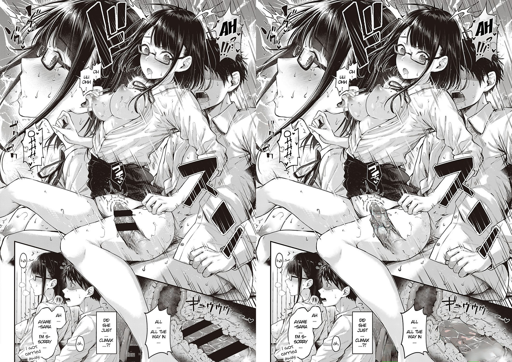
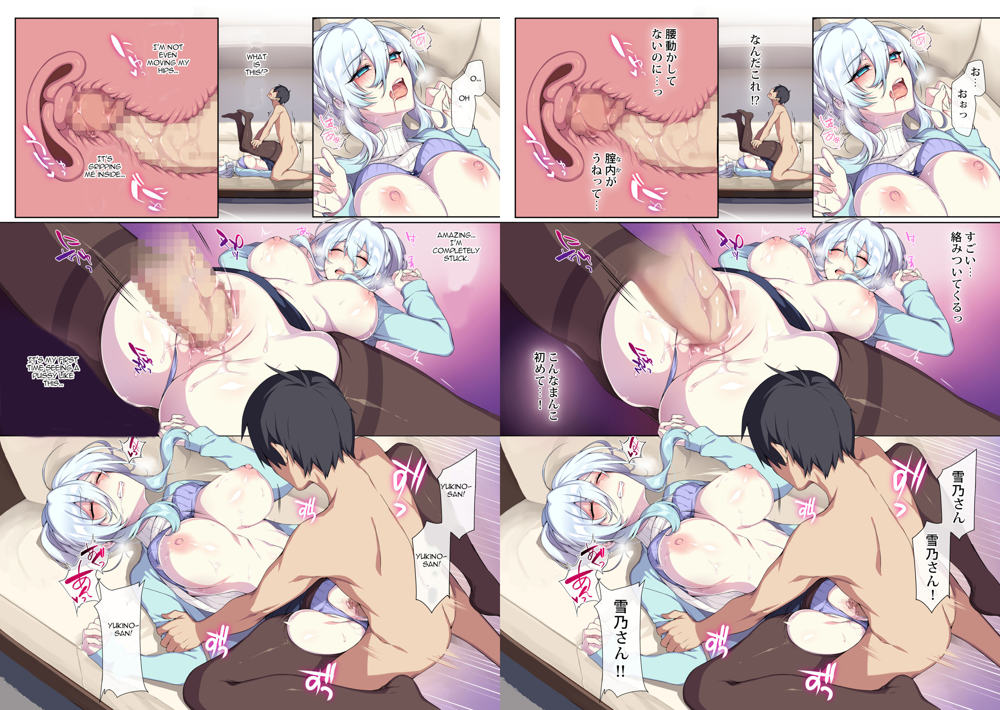

# DoujinCI

DoujinCI is an automated pipeline to decensor doujins with bars or mosaics. Provide a nhentai link, nhentai 6-digit id, or Imgur album link to the pipeline, and it will spit out decensored images in the artifacts of the pipeline job.

DoujinCI builds off of natethegreate's [HentAI](https://github.com/natethegreate/hent-AI) and deeppomf's [DeepCreamPy](https://portrait.gitee.com/1436159772/DeepCreamPy/tree/master), but adds in the convenience of
downloading the doujin automatically, converting the .jpgs to .pngs, removing screentones, and downloading all the right dependencies for HentAI and DeepCreamPy,
which would normally be a huge hassle.

The output is usually imperfect (missed spots, slight green spots), but usually much better than no processing, especially considering it's all automated.

NSFW before/after comparisons

Bars:

Mosaics:

 

# Instructions
[Imgur album](https://imgur.com/a/D1EQYkE), probably the easiest way to learn how to use the pipeline: [https://imgur.com/a/D1EQYkE](https://imgur.com/a/D1EQYkE). Read below for more details.

Pipeline jobs are run on "runners", essentially cloud-hosted computers. Every person is entitled to 400 minutes of runner usage per month on GitLab's "shared runners". As such, you should fork (copy) this repo and run your own
pipelines on your fork, using your own shared runner minutes. Another option is to [host your own runner](https://docs.gitlab.com/runner/), which involves complicated Docker setup, but allows you to run as many pipelines as you want. If you 
have a strong computer setup, this can also decrease the total processing time, so it might be something worth looking into. 

As long as you have some runner available: 

1. Make a GitLab account and [fork](https://docs.gitlab.com/ee/user/project/repository/forking_workflow.html) this repo so that you're using your own minutes instead of mine. You'll probably have to verify with a credit card, GitLab does this to discourage crypto-mining.
2. On the GitLab repo sidebar of your fork, click CI/CD->Pipelines. 
3. Click "Run pipeline" in the top right. You'll then see a screen that allows you to enter variables to mold the pipeline's functionality in a key:value fashion.
4. Put `LINKORID` as a key (left text field) and the nhentai link or nhentai id of the comic as the value (right text field). Note that this app uses **nhentai.xxx IDs, not nhentai.net IDs** (because of Cloudflare blocking bots on .net). Usually, they are the same, but not always. Sometimes, a new upload to .net will not be available yet on .xxx, or it will have a different ID, so you will have to figure that out.
5. The pipeline defaults to bar censorship, if yours has mosaics, put `BARORMOSAIC` as a key and `mosaic` as the value.
6. The pipeline defaults to averaging out pictures to remove [screentones](https://en.wikipedia.org/wiki/Screentone). If you are sure that your comic
doesn't have screentones, you can set `STREMOVE` to `false`. If you set it to false and screentones are actually in your comic, then the output will be bad and time will be wasted.
7. Click "Run pipeline"
8. Wait for the AI and Py jobs to finish. When they're done (and successful), click on the Py job, and on the right middle of the screen
click Download on the Job artifacts. This will be a zip with the decensored images. 
9. Any errors will be printed out in the AI or Py jobs. You can use these error messages to figure out what's wrong.
10. Repeat from step 1 (on your own fork, always) for a different comic if you want.

# Manual Instructions (Downloading and running on your computer, prone to errors and troubleshooting)
If you're not familiar with programming, going through the process of doing everything manually might be challenging, but also 
didactic. Googling error messages will be your best bet.

1. Clone this repository, or download it. 
2. Install Python 3.5 and Python 3.6

The rest of the following steps happen in a terminal.
3. Create two virtual environments in the repository directory, one using Python 3.5 and the other using Python 3.6

Note: We'll be installing the `cpu` based dependencies, I have not tested the gpu dependencies (I don't understand what CUDA is and at this point I'm afraid to ask)
Another note: if you're on Windows, you'll probably have to use backslashes (\) instead of slashes (/) in all the following paths. 
4. Activate the Python 3.5 one and run `pip install -r AI/requirements-cpu.txt`. If there are errors, google them, and also make sure `python --version` says Python 3.5.
5. With 3.5 venv still activated, run `python AI/main.py $LINKORID $BARORMOSAIC $STREMOVE` with your arguments provided, e.g. `python AI/main.py 123456 bar true`. Wait for this to complete.
6. Activate the Python 3.6 venv and run `pip install -r Py/requirements-cpu.txt`. Same troubleshooting advice as step 4.
7. With 3.6 venv still activated, run `python Py/decensor.py`. After a while, the images should be in Py/decensor_output.

# Backstory
In the space of automated comic decensoring, two tools, [HentAI](https://github.com/natethegreate/hent-AI) (AI) and [DeepCreamPy](https://portrait.gitee.com/1436159772/DeepCreamPy/tree/master) (DCP) have existed for a while. The former 
finds bars or mosaics and colours them, and was made to work with the latter, which
fills in those coloured bars. Even though these two complimentary tools exist, using even one of them is a challenge,
as they require Python familiarity, aren't actively supported by their creators, and have lots of dependency bugs in them. I personally had a lot of trouble trying to use them.

What I've done is assembled the best versions of AI and DCP, ironed out the packages and abstracted away all the complexity into a Gitlab CI pipeline. You provide the URL,
and the pipeline spits out the decensored pictures after 15-30 minutes. 

AI and DCP are amazing work that I cannot take for credit for. However, as I said, using them before was clunky, and the code
for both was very messy as they invented their own individual front-end GUIs to operate their algorithms. My work involved
getting rid of all the messy front-ends, revealing only the logic underneath. I also wanted to skip the step where you had to manually
download all the pictures yourself and convert them to pngs and remove screentones, so I wrote custom code to do everything automatically.

I take credit for thinking of using Gitlab CI to do this. Doing so has the advantage that
I can use Python Docker images (image: python:3.5) and requirements files to make these normally finicky dependencies far more reliable.
You could copy this repo and change pretty much nothing, and it would work on another GitLab repo, whereas the same can't be same for the source code.

# Limitations
The free tier of Gitlab CI only allows 400 pipeline minutes per month. 
The decensoring is not perfect, it'll sometimes miss bars and mosaic decensoring is not always good. However, running a censored
comic through this pipeline improves it significantly, and essentially for free.

# Development
Although I am happy with the work done here, I can't promise to maintain it. If you have a feature you want to add, please leave a pull request.
Here are some notes to help with development:

To see what gets run in what order, check out .gitlab-ci.yml. 

Essentially, `AI/main.py` is run on Python 3.5, which downloads from nhentai.xxx, processes all the images, and then `Py/decensor.py` is run on Python 3.6. 
The difference in Python versions is due to the needs of machine learning libraries that the original creators compiled their models with.

Images are downloaded from nhentai.xxx because nhentai.net has CloudFlare protection, and despite my best efforts, I couldn't get [this cli tool](https://pypi.org/project/nhentai/) to accept my cookies/user-agent to bypass CloudFlare.
Nhentai.to, the first mirror I tried, had rate limiting, and Nhentai.xxx could catch on and rate limit us, so if anyone knows better API practice, you can modify AI/ndownloader.py, which I wrote.

### Future features that I won't work on but you could:
- Making both both AI and Py run on the same Python version. This would simplify the pipeline configuration,
and would also make straight up running the code easier. It's unlikely to be possible because of the machine learning versions though.
- Uploading to Imgur for the output
- Trying [DeepMosaics](https://github.com/HypoX64/DeepMosaics) instead of DeepCreamyPy
- Getting the pictures to be in the top level of the artifacts instead of 2 folders in (Py/decensor_output/*.png currently).
- Migrating to Github for Github actions
# Troubleshooting
If you see an error message like "bin/bash killed ###", the runner probably ran out of RAM. If it's a shared runner, not much can be done about that. 
Maybe there's a certain number of pages after which ram runs out?

# Notes
This project isn't technically CI related because it's not like anyone is pushing code that has to be continuously integrated,
but I just associate CI with pipelines and the name had a nice ring to it.

Reddit Post: https://www.reddit.com/r/programming/comments/vaqzst/doujinci_automated_pipeline_for_decensoring
